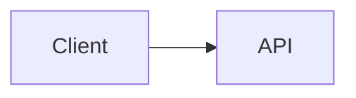

# Writing Markdown for md2html

How to write `.md` that converts well with `md2html`. Every claim here was
checked against the binary; where something silently does nothing, it is
called out rather than left to be discovered.

## Why write Markdown instead of HTML

Converting this repo's own docs, Markdown source against generated HTML:

| Document | Markdown | HTML | Ratio |
|---|---|---|---|
| README.md | 3.8 KB | 8.5 KB | 2.2x |
| design spec | 15.1 KB | 23.2 KB | 1.5x |
| implementation plan | 106 KB | 132 KB | 1.2x |

The ratio shrinks as documents grow, because the stylesheet is a fixed cost.
So "Markdown is cheaper to write" is true but modest — 1.2x to 2.2x on the
markup itself.

The larger saving is the part that does not appear in that table: you do not
write the design layer at all. No typography scale, no dark-mode palette, no
responsive rules, no table overflow handling. That is one embedded stylesheet,
written once and fixed once. Hand-rolling a stylesheet per document means
re-deriving those decisions each time, and re-introducing the same bugs — the
two most recent fixes in this repo were a stylesheet that let long inline code
widen the page, and a slug function that dropped every non-ASCII character.
Both were fixed in one place, for every document.

## What conversion does to your document

Markdown is parsed, re-parsed into a real HTML tree, transformed, then wrapped
in a page. Because it is a real tree, the transforms reach hand-written HTML in
your Markdown as well as generated markup.

You get, without asking:

- every heading gets a stable `id` and a hover anchor link
- every table is wrapped in a horizontal scroll container
- off-site links get `target="_blank" rel="noopener noreferrer"`
- `.md` links become `.html` links that resolve inside the output tree
- a `<title>` from the first `<h1>`, or the filename if there is none

## Links

**Link to `.md`, never to `.html`.** Write the source path; the crawler
rewrites it to the emitted page and computes the relative path for you.

```markdown
[Auth](./api/auth.md)          -> href="api/auth.html"
[Setup](./api/auth.md#setup)   -> href="api/auth.html#setup"   fragment kept
[Home](../index.md)            -> resolved, may still be inside the tree
```

A `.html` link is left exactly as written — it is not a document link, so
nothing rewrites it, and it will point at a file that may not exist.

Recognized document extensions are `.md` and `.markdown`. Everything else is an
asset.

**Assets are linked, never copied.** An image stays where it is, and the link
is rewritten to point back at the original file:

```markdown
   -> src="../../docs/img/arch.png"
```

The consequence: the output tree is self-contained for *documents* but not for
*assets*. Moving `site/` on its own breaks images. Moving `site/` and the
source tree together keeps them working.

**Following is unbounded.** Any `.md` you link to is pulled into the build,
however far it is, including across directory boundaries. `--depth` bounds only
how deep directory *seeding* goes — it never limits link following. One `../`
link into a large repo pulls that repo's reachable docs in; the run prints a
summary of everything it pulled in from outside.

**Links inside code fences are inert.** A fenced example containing
`[a](./nope.md)` is not followed and produces no warning. You can document link
syntax safely.

**A link to a missing `.md` warns and is left alone.** The build continues.

## Features, with the syntax that actually works

### Tables

Plain GFM. Wrapped in `<div class="table-scroll">` automatically — do not wrap
one yourself.

```markdown
| Option | Default |
|---|---|
| `--depth` | unlimited |
```

### Callouts and containers

Fenced containers become `<div>`. **The braces are required.**

```markdown
::: {.callout}
This renders as a styled callout box.
:::

::: {#note .callout .compact}
An id and several classes.
:::
```

`::: {.callout}` and `:::{.callout}` both work. But this does not:

```markdown
::: warning        <- WRONG: silently emits <div> with no class at all
```

The bare form drops the name without warning, so you get an unstyled div and
no error. Always use braces.

**Prefer `.callout`.** It is the one container class the default stylesheet
styles. `.warning`, `.note`, `.tip` and friends produce a correctly classed div
that is visually identical to a plain paragraph unless you supply your own CSS
with `--css`.

Do not hand-write `<div class="callout">` in raw HTML. It works, but it is more
to write and it drops you out of Markdown for the enclosed content.

### Heading ids and classes

Headings get slugs automatically. Override when you want a stable anchor that
survives rewording:

```markdown
## Breaking change in v2 {#breaking-v2 .lead}
```

An explicit id always wins and is never rewritten. Generated slugs are made to
avoid colliding with it, in both directions.

Slugs keep letters and digits from any script, so `## 日本語の見出し` gets
`id="日本語の見出し"` and a working anchor. A heading with no letters or digits
at all falls back to a positional `section-N` id.

One thing that looks wrong in the output and is not: a link you write yourself
to a non-ASCII heading is percent-encoded, while the generated anchor beside
the heading stays literal.

```html
<a href="#%E3%81%AF%E3%81%98%E3%82%81%E3%81%AB">はじめに</a>   your link
<h2 id="はじめに">…<a class="anchor" href="#はじめに">          generated
```

Both resolve to the same heading in a browser. Write the fragment in plain
text; the encoding is a serializer detail, not a mismatch to fix.

### Mermaid diagrams

````markdown

````

A standalone page loads a pinned MermaidJS build from a CDN and initialises it
against the same light/dark signals the stylesheet uses — you do not need to
theme the diagram yourself. Only pages that contain a diagram load it.

With `--fragment` nothing is injected, because Artifacts render mermaid
natively.

### Footnotes, definition lists, task lists

```markdown
Claim needing support.[^src]

[^src]: The source.

Term
:   The definition.

- [ ] not done
- [x] done
```

All three convert correctly. Note that the default stylesheet styles definition
lists but does **not** style the footnote block or task-list checkboxes — they
render as plain semantic HTML.

### Raw HTML and inline SVG

Raw HTML passes through untouched, including `<style>`, `<script>`, and inline
`<svg>`. Script contents are never re-parsed as Markdown.

Reach for it only when Markdown genuinely cannot express the thing. A diagram
is usually better as a mermaid fence, and a callout as a `:::` container.

### Also available

`~~strikethrough~~`, bare URLs as autolinks, and the rest of GFM.

## What the default theme styles

Styled: headings and anchors, paragraphs, lists, tables, code and `<pre>`,
blockquotes, `<hr>`, images, video, inline SVG, definition lists, and
`.callout`.

Not styled: the footnote block, and task-list checkboxes.

**Every class you write is inert unless the stylesheet names it.** `.callout`
is the only one it does. A class on a container (`::: {.warning}`) or on a
heading (`## Title {.lead}`) is faithfully emitted and then ignored — the
markup is correct, the page looks unchanged. Write such classes only as hooks
for a stylesheet you are actually going to supply.

Supply `--css mine.css` to replace the stylesheet entirely.

## Traps

- **`::: name` without braces** silently produces an unclassed div.
- **Linking to `.html`** is never rewritten and will usually 404.
- **`a.md` and `a.markdown` in one directory** both map to `a.html`, and the
  build refuses the whole run rather than racing two writes to one path.
- **`<source srcset>`, ``, `<video poster>`, `<track src>` and
  `<object data>`** are not rewritten or existence-checked. Use `` or
  Markdown image syntax for anything that must be rewritten.
- **Query strings on document links** are dropped: `./b.md?v=2` becomes
  `b.html`. Fragments are preserved; query strings are not.
- **No navigation is generated.** There is no sidebar, index, or table of
  contents. Write your own contents list with anchor links — the heading ids
  are stable and predictable, so this is reliable.
- **Existing HTML is never overwritten.** A file without the tool's provenance
  marker is refused and the run exits non-zero. There is no override flag.

## Artifact-shaped output

`--fragment` emits the marker, `<title>`, `<style>`, and body content, with no
`<!doctype>`, `<html>`, `<head>` or `<body>` — the shape the Artifact tool
expects, publishable unchanged.

This is a way to skip hand-writing an artifact's HTML for **document-shaped**
content: a report, a spec, a guide. It is not a substitute for the
`artifact-design` skill, which still governs the design decision — and if the
page wants a bespoke look, an app-like layout, or anything beyond a styled
document, write it as HTML and use that skill instead. The Artifact tool can
also publish Markdown directly when a skill instructs it; that path uses
Claude's own rendering rather than this stylesheet and these transforms.
