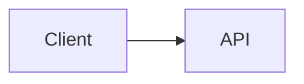

# Writing Markdown for md2html

How to write `.md` that converts well with `md2html`. Every claim here was
checked against the binary; where something silently does nothing, it is
called out rather than left to be discovered.

## Why write Markdown instead of HTML

Converting this repo's own docs, Markdown source against generated HTML:

| Document | Markdown | HTML | Ratio |
|---|---|---|---|
| README.md | 15.5 KB | 39.1 KB | 2.5x |
| design spec | 14.7 KB | 37.5 KB | 2.5x |
| implementation plan | 104 KB | 143 KB | 1.4x |

The ratio shrinks as documents grow, because the stylesheet is a fixed cost.
So "Markdown is cheaper to write" is true but modest — 1.4x to 2.5x on the
markup itself.

The larger saving is the part that does not appear in that table: you do not
write the design layer at all. No typography scale, no dark-mode palette, no
responsive rules, no table overflow handling. That is one embedded stylesheet,
written once and fixed once. Hand-rolling a stylesheet per document means
re-deriving those decisions each time, and re-introducing the same bugs — two
early fixes in this repo were a stylesheet that let long inline code
widen the page, and a slug function that dropped every non-ASCII character.
Both were fixed in one place, for every document.

## What conversion does to your document

Markdown is parsed, re-parsed into a real HTML tree, transformed, then wrapped
in a page. Because it is a real tree, the transforms reach hand-written HTML in
your Markdown as well as generated markup.

You get, without asking:

- every heading gets a stable `id` and a hover anchor link
- every table is wrapped in a horizontal scroll container
- off-site links get `target="_blank" rel="noopener noreferrer"`, added to
  any `rel` you wrote, and a `target` you wrote is kept
- `.md` links become `.html` links that resolve inside the output tree
- a `<title>` from the first `<h1>`, or the filename if there is none

## Links

**Link to `.md`, never to `.html`.** Write the source path; the crawler
rewrites it to the emitted page and computes the relative path for you.

```markdown
[Auth](./api/auth.md)          -> href="api/auth.html"
[Setup](./api/auth.md#setup)   -> href="api/auth.html#setup"   fragment kept
[Home](../index.md)            -> resolved, may still be inside the tree
```

A `.html` link is left exactly as written — it is not a document link, so
nothing rewrites it, and it will point at a file that may not exist.

Recognized document extensions are `.md` and `.markdown`. Everything else is an
asset.

**Assets are linked, never copied.** An image stays where it is, and the link
is rewritten to point back at the original file:

```markdown
   -> src="../../docs/img/arch.png"
```

The consequence: the output tree is self-contained for *documents* but not for
*assets*. Moving `site/` on its own breaks images. Moving `site/` and the
source tree together keeps them working.

**Following is unbounded, by default.** Any `.md` you link to is pulled into
the build, however far it is, including across directory boundaries. `--depth`
bounds only how deep directory *seeding* goes — it never limits link
following. `--link-depth` does, if set: it caps how many hops from a seed a
link may travel, and left at its default (`-1`) following stays unbounded. One
`../` link into a large repo pulls that repo's reachable docs in; the run
prints a summary of everything it pulled in from outside.

**Links inside code fences are inert.** A fenced example containing
`[a](./nope.md)` is not followed and produces no warning. You can document link
syntax safely.

**A link to a missing `.md` warns and is left alone.** The build continues.

**A link or image can carry attributes.** Write a `{#id .class key=value}`
block straight after it, with no space. This is Pandoc's `link_attributes`:

```markdown
[Intro](./intro.md){aria-current=page}  -> <a href="intro.html" aria-current="page">
{width=50% .wide}  -> 
```

The usual reason on a link is `aria-current="page"`, marking the page you
are on inside a hand-written `::: nav`. md2html cannot work that out itself,
because only you know which page a navigation block is on. A block with a
space before it, with no attributes in it (`{}`), or with something that
cannot be an attribute name (`{{version}}`, `{a, b}`) stays as literal text.
`href`, `src` and `srcset` cannot be set this way, and warn: write the target in the
link, where `.md` rewriting can see it.

## Features, with the syntax that actually works

### Choosing between forms

Six constructs accept more than one spelling. None of the alternatives is
deprecated and none is a dialect of ours that others must learn: each exists
because a different ecosystem already writes it that way, and a document
written for that ecosystem should not have to be rewritten to pass through
this tool.

Which one to write depends on where the file is *read*, which is usually not
only here.

| Construct | Forms | Choose by |
|---|---|---|
| Warning, note | `> [!WARNING]` — `::: warning` | **Where it is read.** The alert renders natively on GitHub, Obsidian and Typora, and degrades to an ordinary blockquote with a visible marker anywhere else. `::: warning` shows up on GitHub as literal text. In a repository file the alert is almost always right. |
| Container kind | `::: callout` — `::: {.callout}` — `::: callout {#id .class}` | **Who else parses it.** The braced form is Pandoc's `fenced_divs`, so a document shared with Pandoc, kramdown or MyST keeps its class there — which is also why the braced form's first class token is what selects the kind, not some other marker. The kind-outside-braces form is the clearest of the three to read, but it is md2html's own invention: Pandoc does not parse `::: callout {#id}` as a fenced div at all. Neither unbraced form renders on GitHub. |
| Container title | `::: aside Why` — `:::aside[Why]` | **Whether the title needs to be unambiguous next to attributes.** Every container form now carries a title — see Containers. The label form is still the only one that *delimits* it, so it is what to reach for when a title might itself end in something that looks like a brace group, or when a directive-reading tool (remark-directive, Docusaurus) needs to parse the title out on its own. It is the CommonMark generic directives syntax. |
| Chip, span | `[proven]` — `[proven]{.chip}` — `[c:proven]` | **Vocabulary.** The bare form only works for the six status words. The attribute form is Pandoc's `bracketed_spans`, works for any label or class, and is the form to prefer in new writing. `[c:…]` predates it and still parses. |
| Code caption | `` ```go caption="x" `` — `` ```{.go caption="x"} `` | **Syntax highlighting elsewhere, and quoting.** GitHub reads the first word as the language and ignores the rest, so the brace-free form still highlights there; the braced form does not highlight on GitHub but is what Pandoc and MyST read, and is the only one that can escape a `"` inside the caption. |
| Contents list | `[[toc]]` — `[TOC]` | **Whether the source is read on GitLab.** GitLab renders its own list from `[TOC]`, and GitHub from neither. Otherwise pick for the humans reading the source: `[[toc]]` is markdown-it and VitePress, `[TOC]` is Python-Markdown, MkDocs, Typora and StackEdit. This repo writes `[[toc]]`. |
| Title, subtitle | front matter — an italic line under the `<h1>` | **Whether the metadata is data.** Front matter is machine-readable and hidden by GitHub; the italic line is visible prose everywhere and cannot carry a date. |

Two rules cut across all of them. A form that another renderer does not
understand should still *degrade* to something readable rather than to
noise — which is the whole argument for the alert syntax over `::: warning`.
And nothing here is exclusive: the forms mix freely within a document, so
there is no need to convert a file wholesale to one style.

### Tables

Plain GFM. Wrapped in `<div class="table-scroll">` automatically — do not wrap
one yourself.

```markdown
| Option | Default |
|---|---|
| `--depth` | unlimited |
```

### Containers

Fenced containers become `<div>`, a `<nav>` landmark, or — for two
collapsible kinds — `<details>`. Bare and braced forms are equivalent in
element and classes:

```markdown
::: callout
This renders as a styled callout box.
:::

::: {.callout}
Same thing.
:::
```

The shipped vocabulary is ten kinds: `callout`, `warning`, `card`,
`stats`, `defs` and `group` (`<div>`), `details`, `aside` and `example`
(`<details>`), and `nav` (`<nav>`):

```markdown
::: warning
Overwrites state.
:::
```

renders `<div class="callout callout-warning">`.

**`nav` adds no class of its own** — every other kind styles an element;
this one's whole job is to *be* one, for a landmark a bare `<ul>` of links
would not announce as such. `[[toc]]` already emits its own `<nav
class="toc">`, so a hand-written `nav` container is almost always the
*second* `<nav>` on the page — which is exactly when it needs a name, since
assistive tech otherwise has no way to tell two landmarks apart:

```markdown
::: nav {aria-label="Section contents"}
- [One](./one.md){aria-current=page}
- [Two](./two.md)
:::
```

renders `<nav aria-label="Section contents">`, with the link to the page
you are on marked `aria-current="page"` (see Links).

**`stats`, `defs` and `group` are the figure kinds of the same names as
containers.** Use them whenever one does not sit inside a diagram, and keep
the figure form for when it does. They look the
same as their [structured figure](#structured-figures) forms, but each
entry is ordinary Markdown: a list, a code span, a second paragraph. `stats`
and `defs` hold a definition list. In `stats`, each term is a tile's value,
its first definition the label, and an optional second definition a detail
line:

```markdown
::: stats
99.9%
: uptime
: over the last 90 days

4
: regions
:::

::: defs
fence
: a line of colons
:::

::: group[Ingest]
Parse each file, then validate it.
:::
```

A `stats` or `defs` container without a definition list still renders, and
warns. A `group`'s title is its container title; the figure form's `note`,
`foot` and `accent` have no container equivalent, because a paragraph or a
class already says each of them.

**Every form carries a title now.** Write it on the fence's opening line,
delimit it in brackets, or put it after a braced attribute block — these
all render the same `<summary>Why this matters</summary>`:

```markdown
::: aside Why this matters
Because.
:::

:::aside[Why this matters]
Because.
:::

::: {.aside} Why this matters
Because.
:::

::: aside Why this matters {#why .compact}
Because.
:::
```

and the last of those also carries the id and class onto the `<details>`,
same as the label form below.

The label form is the directive syntax from the CommonMark generic
directives proposal, as implemented by remark-directive and used by
Docusaurus. It is still the one to reach for when the title needs to stay
unambiguous next to an id or classes, because it *delimits* the title
rather than reading to the end of the line:

```markdown
:::aside[Why this matters]{#why .compact}
```

Every other spelling instead treats a trailing `{...}` on the fence line as
the attribute block, with everything before it — after the kind, if the
kind sits outside braces — read as the title. That is right almost always,
with one trap: a title that itself *ends* in something shaped like a brace
group is read as attributes, not words. `::: card The {x}` titles the card
"The" and consumes `{x}` as an (empty) attribute. Reach for the label form,
or avoid a trailing brace-like title, when that shape is a real risk.

A label form naming an unknown kind falls through to the bare form's rules
and warns there, so `:::housestyle[Title]` is reported, not silently
dropped.

`details` carries no prefix at all — a titled block's `<summary>` is exactly
its title, and a titleless one falls back to "Details". `aside` with no
title falls back to "Aside" in its `<summary>`; `example` falls back to
"Example", or "Example — Title" when one is given.

**Classes merge, they never replace.** A braced container's extra classes
and id survive alongside the kind's own:

```markdown
::: {#note .callout .compact}
An id and several classes.
:::
```

renders `<div id="note" class="callout compact">`.

**Kind-matching inspects only the first class token.** `{.callout
.compact}` normalizes; `{.compact .callout}` does not — `compact` is
checked as the kind name, isn't one, and the whole class list is left
exactly as written, unstyled. Put the kind word first.

That positional rule is also the bridge to Pandoc: a document written for
`fenced_divs` spells its kind as an ordinary first class — `{.warning}`,
`{.aside}` — and reading the kind off that token, rather than from some
marker of our own, is what lets such a document pick up md2html's styling
for free instead of landing as an unclassed div. The rule cannot be
retired without changing what three shipped kinds do: `{.warning}` would
fall from `<div class="callout callout-warning">` to a plain `<div
class="warning">`, and `{.aside}` / `{.example}` would stop being
collapsible.

The kind can also sit outside the braces, with a real attribute block
after it — a third spelling, alongside the bare and braced forms:

```markdown
::: aside {#id .compact}
Because.
:::
```

renders `<details id="id" class="container aside compact">`.

Containers nest.

An unknown bare kind (`::: house-style`) consumes its kind word and any
title, emits an unclassed `<div>`, and the run warns; the title still
reaches the page, as an ordinary paragraph with no styling class to hang
on a kind that does not exist. A braced class outside the vocabulary
(`::: {.house-brand}`) emits a correctly classed, unstyled `<div>` —
silently, since the author supplies their own CSS for it.

**A container passes a fixed attribute set through.** `id`, `class`,
goldmark's global attribute list, and any `data-` or `aria-` name reach the
element; anything else — an event handler, most obviously — is dropped,
and an attribute name outside `[A-Za-z][A-Za-z0-9_.:-]*` is dropped
whatever prefix it carries. The braced grammar itself also accepts a bare
key with no value and a single-quoted value, not just `key="value"`:

```markdown
::: {.callout data-flag}
Because.
:::

::: {.callout data-x='single'}
Because.
:::
```

render `<div class="callout" data-flag="">` and `<div class="callout"
data-x="single">`.

```markdown
::: card {onclick="alert(1)" data-tracking="x"}
Because.
:::
```

renders `<div data-tracking="x" class="card">` — the tracking attribute
survives, the handler does not. `data-fence` is a reserved *namespace*, not
three literal names: any attribute whose name **begins with** `data-fence`
is dropped, with no hyphen required at the boundary — `data-fence-kind`,
`data-fence-title` and an unrelated `data-fencepost` are all dropped alike,
so writing one yourself gets it silently dropped rather than honored. Case
does not matter either, because an HTML attribute name has none:
`data-Fence-Title` is the same reserved name as `data-fence-title`. The
`data-` and `aria-` allowlist above is case-insensitive for the same reason,
so `ARIA-label` is honored exactly like `aria-label`.

Do not hand-write `<div class="callout">` in raw HTML. It works, but it is more
to write and it drops you out of Markdown for the enclosed content.

### Alerts

GitHub's alert syntax is accepted and renders as the matching container:

```markdown
> [!WARNING]
> Overwrites state.
```

is exactly `::: warning`. The five types map onto the two shipped kinds —
`NOTE`, `TIP` and `IMPORTANT` to `callout`; `WARNING` and `CAUTION` to
`callout callout-warning`.

**Prefer this to `::: warning` in a file that lives in a repository.**
GitHub, Obsidian and Typora all render it natively, and a renderer that
does not know it shows an ordinary blockquote with a visible marker.
`::: warning` shows up on GitHub as the literal text `::: warning`.

The marker must be upper case and alone on its first line, exactly as
GitHub requires — accepting more would let a document render here and not
there. `[!HINT]`, `[!note]` and a marker mid-sentence are all left as
ordinary blockquotes.

The three informational types collapse onto one appearance because the
stylesheet draws one informational box. The distinction survives in the
source, where GitHub still renders all three differently.

### Status chips

A fixed vocabulary of bracketed words becomes a small badge, in body text
or in a heading alike:

```markdown
[proven] [verified] [designed] [planned] [draft] [deprecated]
```

Each becomes `<span class="chip chip-proven">proven</span>` (and so on).

Anything outside that list uses the attribute form — Pandoc's
`bracketed_spans`, and the form to prefer in new writing:

```markdown
[needs review]{.chip}      ->   <span class="chip">needs review</span>
[proven]{.chip}            ->   <span class="chip chip-proven">proven</span>
[shipped]{.chip .chip-ok}  ->   <span class="chip chip-ok">shipped</span>
```

A status word picks up its `chip-<word>` class automatically; write your
own `chip-*` class and yours is used instead. The form is general, not
chip-only — `[lead in]{.lead}` is a `<span class="lead">`, subject to the
usual rule that a class the stylesheet does not name is inert.

The older escape hatch still works and is no longer the recommended
spelling:

```markdown
[c:needs review]   ->   <span class="chip">needs review</span>
```

`[c:]` — no label — is left as literal text: an empty badge is worse than
showing the author what they wrote.

A chip on a heading never enters its slug or the page `<title>`:
`## 4.2 Rollback [proven]` still gets `id="42-rollback"`, so relabeling or
removing a marker later never rots an anchor or retitles the tab. A chip
inside a code span or code block is inert — `` `[proven]` `` stays literal
text, not a badge — and a bracketed word outside the vocabulary, like
`[1]`, is never touched.

### Section cross-references

`§4.2` autolinks to whichever heading's visible text begins with the number
`4.2` — followed by a space, or by the end of the heading:

```markdown
## 4.2 Rollback

See §4.2 for details.   ->   <a class="xref" href="#42-rollback">§4.2</a>
```

**That separator is part of the rule, and a trailing dot breaks it.** A
heading written `## 4.2. Rollback` claims no number at all, because what
follows `4.2` is a `.` rather than a space — so `§4.2` in prose stays plain
text, silently. Number headings `4.2`, not `4.2.`. A heading that is
*only* a number (`## 4.2.1`) is fine: the end of the heading is the
separator.

No heading claims that number: left as plain text. Two things opt out even
when a number does match:

- **A possessive scoping it to another document** — "the design doc's §7"
  — is recognized and left literal. Any other cross-document phrasing
  still needs an escape.
- **A code span**: `` `§4.2` `` stays literal, same as any other inline
  code.

This resolves against heading ids after they are assigned, so an explicit
`{#custom-id}` is what a reference to that heading's number resolves to.

### Contents list

`[[toc]]` alone on its own line — nothing else in the paragraph — becomes a
flat `<nav class="toc">` listing every heading in the current document, in
document order, each linking to its id:

```markdown
[[toc]]
```

`[TOC]` works too, and case does not matter for either. Two conventions
exist — `[[toc]]` is markdown-it and VitePress, `[TOC]` is
Python-Markdown and so MkDocs, as well as Typora and StackEdit — and a
document written for one should not have to be rewritten for this tool.

For a document that is also read on GitLab, write `[TOC]`: GitLab builds
its own contents list from that spelling, so the marker works in both
places. GitHub builds a list from neither. Otherwise the choice is about the
humans reading the source. This repo writes `[[toc]]`.

GitLab's other spelling, `[[_TOC_]]`, is **not** recognized: its
underscores are emphasis delimiters, so the marker never arrives as the
single unbroken run of text this feature requires.

Flat, not nested: heading level travels only as a `toc-h3`/`toc-h4`/… class
on the `<li>`, so a document that jumps from `h2` to `h4` doesn't produce
broken list nesting. Chips and the heading's own anchor link are excluded
from the link text.

The list is named for screen readers, as `<nav class="toc"
aria-label="Table of Contents">`, so it can be told apart from a
hand-written `::: nav` on the same page. Nothing about it is visible. A page
in another language renames it with the `toc-title` front matter key, which
is Pandoc's key for the same label:

```markdown
---
lang: de
toc-title: Inhalt
---
```

The marker must be the paragraph's *entire* content. Wrapped in a link or a
code span, it is left alone — `` `[[toc]]` `` and a link whose text happens
to be `[[toc]]` both stay literal. A document with no linkable headings —
none present, or built with `--no-anchors` — leaves the marker as literal
text rather than deleting it, so the reader isn't left wondering where the
list went.

This is a per-page contents list only — see Traps for what is still out of
scope.

### Front matter

A leading `---`-delimited block of flat `key: value` lines sets `title`,
`subtitle`, `date`, `lang` and `toc-title`:

```markdown
---
title: Reference
subtitle: every new convention
date: 2026-09-11
lang: en-GB
---

# Reference
```

Only those five keys do anything; any other key is silently stripped from
the body and dropped. A repeated key keeps the last value. `subtitle` and
`date` render as `<p class="subtitle">` / `<p class="docdate">` immediately
under the document's leading `<h1>` — body nodes, not a page-shell slot.
`toc-title` names the contents list; see Contents list.

`lang` is the page's `<html lang>`, which screen readers use to pick a
voice and browsers use for hyphenation and spell-checking. It is the key
Pandoc reads for the same attribute. It overrides `--lang`, which sets a
default for the whole run; with neither, a page is `en`. A value that is not
a language tag, such as `en_US` or `English`, warns and is ignored.
`--fragment` output has no `<html>` element, so it has nowhere to go and is
left to the host page.

**The block must be flat.** An indented (nested) value makes the whole
thing fail to parse as front matter, and it falls through to being rendered
as visible Markdown — an `<hr>` followed by whatever heading-like thing the
leftover lines happen to form. That is intentionally noisy, so a malformed
block is hard to miss.

Without front matter, an italic line immediately after the leading `<h1>`
is lifted into the same subtitle — but only when neither a subtitle nor a
title was supplied some other way (front matter, or `Options` in library
use):

```markdown
# Reference

*every new convention*
```

### Code captions

A `caption="…"` attribute in a fenced code block's info string renders a
caption bar above the code, wrapping the block in a `<figure>`:

````markdown
```go caption="server.go"
func main() {}
```
````

renders `<figure class="code-figure"><figcaption>server.go</figcaption>`
around the existing `<pre><code class="language-go">`.

The caption may come before the language — `` ```caption="x.go" go `` still
yields `class="language-go"` — since only the caption token is stripped
out; the language is whatever token is left, not whatever is first.

Prefer this brace-free form in a file that is also read on GitHub: GitHub
takes the first word of an info string as the language and ignores whatever
follows, so the block still gets syntax highlighting there even though the
caption itself does nothing.

**The braced form works too**, and is what a document written for Pandoc,
kramdown or MyST will use:

````markdown
```{.go caption="server.go"}
```go {caption="server.go"}
````

In the braced form the language is the first class, as Pandoc reads it,
unless a word outside the braces names one — so `` ```go {.wide} `` is Go
with a `wide` class. An `id` reaches the `<pre>` and any further class
reaches the `<code>`, rather than being dropped.

The cost is the highlighting: `{.go …}` is not a language name to GitHub,
so a braced block renders there unhighlighted. Choose by which matters more
for the file in hand — and note the one thing only the braced form can do.

There is no escaping for a quote embedded in the caption's value in the
brace-free form — `caption="has \"quote\""` does not produce a caption
containing a literal `"`. The braced form does support it, so write
`` ```{.go caption="has \"quote\""} `` when you need one.

The caption's text runs through the same inline rewriters as any other
prose: a status chip or a `§` cross-reference inside a caption renders as a
badge or a link, exactly as it would in a paragraph, not as literal text.

````markdown
```go caption="[proven] auth handler"
func handleAuth() {}
```
````

renders a `<span class="chip chip-proven">` inside the `<figcaption>`.

### Heading ids and classes

Headings get slugs automatically. Override when you want a stable anchor that
survives rewording:

```markdown
## Breaking change in v2 {#breaking-v2 .lead}
```

An explicit id always wins and is never rewritten. Generated slugs are made to
avoid colliding with it, in both directions, and with an id anywhere else on
the page: after `[Setup](./setup.md){#setup}`, a `## Setup` heading gets
`#setup-1`.

Slugs keep letters and digits from any script, so `## 日本語の見出し` gets
`id="日本語の見出し"` and a working anchor. A heading with no letters or digits
at all falls back to a positional `section-N` id.

Otherwise slugs follow the rules GitHub, GitLab and Pandoc's `commonmark_x`
share, so an in-page link written against any of them resolves here too.
Punctuation is dropped, but each space still becomes a hyphen and nothing is
merged afterwards: `## Sizes: small × large` is `#sizes-small--large`, and
`## — Intro` is `#-intro`. Underscores are kept. A repeated heading is
numbered `-1`, `-2`…, so the second `## Setup` is `#setup-1`. Two small
differences remain: an emoji is dropped, as GitHub does, where Pandoc spells
it out by name, and chips stay out of the slug, which no other renderer
knows to do.

One thing that looks wrong in the output and is not: a link you write yourself
to a non-ASCII heading is percent-encoded, while the generated anchor beside
the heading stays literal.

```html
<a href="#%E3%81%AF%E3%81%98%E3%82%81%E3%81%AB">はじめに</a>   your link
<h2 id="はじめに">…<a class="anchor" href="#はじめに">          generated
```

Both resolve to the same heading in a browser. Write the fragment in plain
text; the encoding is a serializer detail, not a mismatch to fix.

### Mermaid diagrams

````markdown

````

A standalone page loads a pinned MermaidJS build from a CDN and initialises it
against the same light/dark signals the stylesheet uses — you do not need to
theme the diagram yourself. Only pages that contain a diagram load it.

With `--fragment` nothing is injected, because a fragment's host is expected
to render mermaid itself, as Claude Artifacts do.

### Structured figures

A ```` ```fig ```` fence is a hand-laid-out diagram: boxes, arrows and
panels you place yourself, for layouts a mermaid graph cannot express. The
body is YAML.

(The examples below are shown in `yaml` fences. In a real document they go
in a `fig` fence — shown that way here, they would render as figures
instead of showing you the syntax.)

```yaml
caption: Request path
items:
  - box: Client
  - arrow: HTTP POST
  - group: Server
    items:
      - box: "`auth` middleware"
      - result: 200 OK
```

Every item is exactly one *kind*:

| Kind | Value | What it is |
|---|---|---|
| `box` | label | a labeled box |
| `arrow` | label, may be `""` | a connector; blank is decorative |
| `result` | label | an emphasized outcome bar |
| `rail` | label | a full-width accent rail |
| `stats` | list of `value`/`label`, plus optional `detail` | a row of stat tiles |
| `defs` | list of `term`/`def` | a term/definition grid |
| `group` | title, plus `items` | a labeled container |
| `chain` | list of items | steps connected in sequence |
| `lanes` | list of lists | parallel stacks |
| `tree` | an indented block scalar | a file or config hierarchy |
| `cols` | list of items | items side by side, anywhere an item goes |
| `split` | list of exactly 2 items | two panels either side of a `boundary` |

**Use `stats`, `defs` and `group` in a figure only when they are part of
the diagram**, sitting beside boxes, in a column or under an arrow.
Otherwise use the [container](#containers) form, `::: stats`, `::: defs` or
`::: group`. It looks the same, each entry can be block Markdown rather
than one line of inline text, and on GitHub or in Pandoc it still reads as
a definition list instead of a block of YAML.

`layout` is `rows` (the default), `cols`, or `split`. Under `cols`, a
top-level item may carry `weight` (1–12; out-of-range values are clamped,
not rejected). Under `split`, exactly two items sit either side of a
`boundary` label.

`cols` and `split` are also item kinds, so a layout can sit anywhere an
item can — context above a split and an outcome below it, or a split
inside one column:

```yaml
items:
  - rail: A request crosses one trust boundary
  - split:
      - group: Client
        items: [{box: Browser}]
      - group: Server
        items: [{box: Handler}]
    boundary: TLS
  - result: The response is signed
```

A `cols` item's children take `weight` exactly as a `cols` figure's items
do. Inside a `chain`, the other steps size to their content and a `cols`
or `split` step takes the width they leave, so its weights share out that
width rather than the whole row's. A
figure whose only item is a `cols` or `split` item is an error: that
is `layout: cols` or `layout: split` spelled a second way, and the warning
names the spelling to use.

Some kinds take **modifiers** alongside their value:

| Modifier | On | What it does |
|---|---|---|
| `note` | `box`, `result`, `rail`, `group` | a quieter gloss beside the label |
| `accent` | `box`, `result`, `rail`, `group` | marks this item out from its siblings |
| `foot` | `group` | a trailing line below the group's items |
| `boundary` | `split` | the label between its two panels |

A modifier used anywhere else is an error, not a silent no-op.

`detail` is not in that table because it belongs to a `stats` entry, not
to an item kind: it is a third, quieter line beneath a stat tile's label.

`note` and `foot` are different positions on a `group`, not alternatives. A
`note` follows the title and glosses it — the reader meets it before the
group's items. A `foot` follows those items. A group may carry both.

**A panel that needs a title, an accent or a footnote is a `group`.** There
is no panel-level metadata: put a `group` inside the panel and use its
title, `accent` and `foot`. The same goes for a lane of a `lanes` item.

**Every panel draws a card** — a border and padding around whatever item
sits in it, on top of that item's own look. A panel whose item carries
`accent` tints its card. A panel holding an arrow draws no card, so a
`cols` of group, arrow, group still reads as one thing leading to another.

Set `wide: true` at the top level to let a figure break out of the text
column.

A `tree` is an indented listing, one node per line:

```yaml
items:
  - tree: |
      fig.go -- the fence branch
        * figtree.go -- the line grammar
      - testdata/ -- not shipped
```

Leading spaces carry the nesting — any consistent width works. On each line,
` -- ` (with a space on both sides) splits the label from a trailing note,
`* ` marks the line as accented and `- ` as de-emphasized.

Every sigil needs its space, which is what keeps `*_test.go` a literal glob
and splits `md2html --fragment -- writes a fragment` at the second `--` and
not the first. To write one literally anyway, escape it as you would in
Markdown: `go run \-- args`.

Every text field takes inline Markdown, so code spans, links, chips and
`§` references work in a label exactly as in prose. A `.md` link inside a
figure is rewritten and crawled like any other.

**A figure that does not parse or validate renders as a code block and
warns.** You see your own YAML, unstyled — the run says which item and why.
An intentionally blank box is `box: ""`; a bare `box:` names no kind and is
an error. Line numbers in a warning count from the first line of the fence
body, not from the top of the file.

A figure's caption is the `caption:` key in the body. The `caption="…"`
info-string attribute that `code` fences take does nothing on a `fig` fence
and warns.

### Footnotes, definition lists, task lists

```markdown
Claim needing support.[^src]

[^src]: The source.

Term
:   The definition.

- [ ] not done
- [x] done
```

All three convert correctly. Note that the default stylesheet styles definition
lists but does **not** style the footnote block or task-list checkboxes — they
render as plain semantic HTML.

### Raw HTML and inline SVG

Raw HTML passes through untouched, including `<style>`, `<script>`, and inline
`<svg>`. Script contents are never re-parsed as Markdown.

Reach for it only when Markdown genuinely cannot express the thing. A diagram
is usually better as a mermaid fence, and a callout as a `:::` container.

### Also available

`~~strikethrough~~`, bare URLs as autolinks, and the rest of GFM.

### Images and inline SVG click to expand

A standalone page wires up the same click-to-expand a mermaid diagram gets:
an `` image or a hand-authored inline `<svg>` that's actually
being scaled down to fit the prose measure becomes clickable, opening a
native `<dialog>` sized against the viewport instead. Nothing to opt into —
it's automatic, and skips anything already at its own size (so icons and
badges don't get a zoom cursor), anything already wrapped in a link, and
mermaid's own SVG (which the other runtime already handles).

With `--fragment` nothing is injected, matching the mermaid runtime.

## What the default theme styles

Styled: headings and anchors, paragraphs, lists, tables, code and `<pre>`,
blockquotes, `<hr>`, images, video, inline SVG, definition lists, the shipped
containers (`.callout`, `.callout-warning`, `.card`, `details.container`,
`.example`, `.stats`, `.defs`, `.group`), status chips, cross-references (`.xref`), the contents list
(`nav.toc`), document metadata (`.subtitle`, `.docdate`), and code captions
(`.code-figure`).

Not styled: the footnote block, and task-list checkboxes.

**A class you write is inert unless the stylesheet names it.** The shipped
vocabulary above does; nothing else does. A class on a container outside
that vocabulary (`::: {.house-brand}`) or on a heading (`## Title {.lead}`)
is faithfully emitted and then ignored — the markup is correct, the page
looks unchanged. Write such classes only as hooks for a stylesheet you are
actually going to supply.

Supply `--css mine.css` to replace the stylesheet entirely.

## Traps

- **A fence inside a fence needs more backticks on the outside.** A
  ```` ```markdown ```` block whose body contains a ``` ``` ``` line ends
  at that line, not at the one you meant — the rest of your example
  becomes body text and the block after it inherits the wrong language.
  Use a four-backtick fence to show three-backtick source. This is silent:
  nothing warns, and the page renders as *something*.
- **Container kind-matching checks only the first class token.** `{.compact
  .callout}` is not recognized as `callout`; put the kind word first:
  `{.callout .compact}`. A bare unknown kind (`::: house-style`) warns; a
  braced unknown class does not.
- **A cross-reference scoped to another document may still autolink.** Only
  the possessive phrasing ("the design doc's §7") is recognized as
  cross-document. Write `` `§7` `` to keep any other phrasing literal.
- **Front matter must be flat `key: value`.** A nested value makes the whole
  block render as visible text above the title rather than being parsed.
- **Only `caption=` is read from a *brace-free* code fence info string.**
  In the braced form an `id`, classes and `caption` are all read; any other
  key is still ignored.
- **Linking to `.html`** is never rewritten and will usually 404.
- **`a.md` and `a.markdown` in one directory** both map to `a.html`, and the
  build refuses the whole run rather than racing two writes to one path.
- **`<source srcset>`, ``, `<video poster>`, `<track src>` and
  `<object data>`** are not rewritten or existence-checked. Use `` or
  Markdown image syntax for anything that must be rewritten.
- **Query strings on document links** are dropped: `./b.md?v=2` becomes
  `b.html`. Fragments are preserved; query strings are not.
- **A link into an `--exclude`d directory keeps its href as written.** The
  target is never converted, so the link resolves to whatever that subtree's
  own tool produced — which is the point — but nothing checks that it did.
  The run warns once per such link.
- **No cross-document navigation is generated.** There is still no sidebar
  or site index. `[[toc]]` gives a per-page contents list; anything that
  reaches across documents you still write yourself with anchor links — the
  heading ids are stable and predictable, so this is reliable.
- **Several entry points build as one set.** `md2html -o ./site ./docs
  ./notes` emits both trees into one output root, with links between them
  rewritten. Nothing has to be added to a standing entry list to include a
  directory for a single run.
- **Existing HTML is never overwritten.** A file without the tool's provenance
  marker is refused and the run exits non-zero. There is no override flag.

## Fragment output

`--fragment` emits the marker, `<title>`, `<style>`, and body content, with no
`<!doctype>`, `<html>`, `<head>` or `<body>` — for a host that supplies the
document wrapper itself, such as a Claude Artifact, which publishes it
unchanged.

This is a way to skip hand-writing HTML for **document-shaped** content: a
report, a spec, a guide. If the page wants a bespoke look, an app-like layout,
or anything beyond a styled document, write it as HTML instead.
