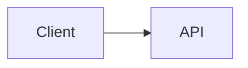

# Writing Markdown for md2html

How to write `.md` that converts well with `md2html`. Every claim here was
checked against the binary; where something silently does nothing, it is
called out rather than left to be discovered.

## Why write Markdown instead of HTML

Converting this repo's own docs, Markdown source against generated HTML:

| Document | Markdown | HTML | Ratio |
|---|---|---|---|
| README.md | 3.8 KB | 8.5 KB | 2.2x |
| design spec | 15.1 KB | 23.2 KB | 1.5x |
| implementation plan | 106 KB | 132 KB | 1.2x |

The ratio shrinks as documents grow, because the stylesheet is a fixed cost.
So "Markdown is cheaper to write" is true but modest — 1.2x to 2.2x on the
markup itself.

The larger saving is the part that does not appear in that table: you do not
write the design layer at all. No typography scale, no dark-mode palette, no
responsive rules, no table overflow handling. That is one embedded stylesheet,
written once and fixed once. Hand-rolling a stylesheet per document means
re-deriving those decisions each time, and re-introducing the same bugs — the
two most recent fixes in this repo were a stylesheet that let long inline code
widen the page, and a slug function that dropped every non-ASCII character.
Both were fixed in one place, for every document.

## What conversion does to your document

Markdown is parsed, re-parsed into a real HTML tree, transformed, then wrapped
in a page. Because it is a real tree, the transforms reach hand-written HTML in
your Markdown as well as generated markup.

You get, without asking:

- every heading gets a stable `id` and a hover anchor link
- every table is wrapped in a horizontal scroll container
- off-site links get `target="_blank" rel="noopener noreferrer"`
- `.md` links become `.html` links that resolve inside the output tree
- a `<title>` from the first `<h1>`, or the filename if there is none

## Links

**Link to `.md`, never to `.html`.** Write the source path; the crawler
rewrites it to the emitted page and computes the relative path for you.

```markdown
[Auth](./api/auth.md)          -> href="api/auth.html"
[Setup](./api/auth.md#setup)   -> href="api/auth.html#setup"   fragment kept
[Home](../index.md)            -> resolved, may still be inside the tree
```

A `.html` link is left exactly as written — it is not a document link, so
nothing rewrites it, and it will point at a file that may not exist.

Recognized document extensions are `.md` and `.markdown`. Everything else is an
asset.

**Assets are linked, never copied.** An image stays where it is, and the link
is rewritten to point back at the original file:

```markdown
   -> src="../../docs/img/arch.png"
```

The consequence: the output tree is self-contained for *documents* but not for
*assets*. Moving `site/` on its own breaks images. Moving `site/` and the
source tree together keeps them working.

**Following is unbounded, by default.** Any `.md` you link to is pulled into
the build, however far it is, including across directory boundaries. `--depth`
bounds only how deep directory *seeding* goes — it never limits link
following. `--link-depth` does, if set: it caps how many hops from a seed a
link may travel, and left at its default (`0`) following stays unbounded. One
`../` link into a large repo pulls that repo's reachable docs in; the run
prints a summary of everything it pulled in from outside.

**Links inside code fences are inert.** A fenced example containing
`[a](./nope.md)` is not followed and produces no warning. You can document link
syntax safely.

**A link to a missing `.md` warns and is left alone.** The build continues.

## Features, with the syntax that actually works

### Tables

Plain GFM. Wrapped in `<div class="table-scroll">` automatically — do not wrap
one yourself.

```markdown
| Option | Default |
|---|---|
| `--depth` | unlimited |
```

### Containers

Fenced containers become `<div>`, except two kinds which become collapsible
`<details>`. Bare and braced forms are equivalent in element and classes:

```markdown
::: callout
This renders as a styled callout box.
:::

::: {.callout}
Same thing.
:::
```

The shipped vocabulary is `callout`, `warning` and `card` (`<div>`), and
`aside` and `example` (`<details>`):

```markdown
::: warning
Overwrites state.
:::
```

renders `<div class="callout callout-warning">`.

**Only the bare form can carry a title**, written on the fence's opening
line:

```markdown
::: aside Why this matters
Because.
:::
```

The braced form structurally cannot: goldmark's fence library merges the
rest of the opening line into the container's first paragraph, so a title
after `{.aside}` is indistinguishable from a first line of body text. Give
up the brace, or give up the title.

`aside` with no title falls back to "Aside" in its `<summary>`; `example`
falls back to "Example", or "Example — Title" when one is given.

**Classes merge, they never replace.** A braced container's extra classes
and id survive alongside the kind's own:

```markdown
::: {#note .callout .compact}
An id and several classes.
:::
```

renders `<div id="note" class="callout compact">`.

**Kind-matching inspects only the first class token.** `{.callout
.compact}` normalizes; `{.compact .callout}` does not — `compact` is
checked as the kind name, isn't one, and the whole class list is left
exactly as written, unstyled. Put the kind word first.

Containers nest.

An unknown bare kind (`::: house-style`) emits an unclassed `<div>` and the
run warns. A braced class outside the vocabulary (`::: {.house-brand}`)
emits a correctly classed, unstyled `<div>` — silently, since the author
supplies their own CSS for it.

Do not hand-write `<div class="callout">` in raw HTML. It works, but it is more
to write and it drops you out of Markdown for the enclosed content.

### Status chips

A fixed vocabulary of bracketed words becomes a small badge, in body text
or in a heading alike:

```markdown
[proven] [verified] [designed] [planned] [draft] [deprecated]
```

Each becomes `<span class="chip chip-proven">proven</span>` (and so on).
Anything outside that list needs the escape hatch:

```markdown
[c:needs review]   ->   <span class="chip">needs review</span>
```

`[c:]` — no label — is left as literal text: an empty badge is worse than
showing the author what they wrote.

A chip on a heading never enters its slug or the page `<title>`:
`## 4.2 Rollback [proven]` still gets `id="42-rollback"`, so relabeling or
removing a marker later never rots an anchor or retitles the tab. A chip
inside a code span or code block is inert — `` `[proven]` `` stays literal
text, not a badge — and a bracketed word outside the vocabulary, like
`[1]`, is never touched.

### Section cross-references

`§4.2` autolinks to whichever heading's visible text begins with the number
`4.2`:

```markdown
## 4.2 Rollback

See §4.2 for details.   ->   <a class="xref" href="#42-rollback">§4.2</a>
```

No heading claims that number: left as plain text. Two things opt out even
when a number does match:

- **A possessive scoping it to another document** — "the design doc's §7"
  — is recognized and left literal. Any other cross-document phrasing
  still needs an escape.
- **A code span**: `` `§4.2` `` stays literal, same as any other inline
  code.

This resolves against heading ids after they are assigned, so an explicit
`{#custom-id}` is what a reference to that heading's number resolves to.

### Contents list

`[[toc]]` alone on its own line — nothing else in the paragraph — becomes a
flat `<nav class="toc">` listing every heading in the current document, in
document order, each linking to its id:

```markdown
[[toc]]
```

Flat, not nested: heading level travels only as a `toc-h3`/`toc-h4`/… class
on the `<li>`, so a document that jumps from `h2` to `h4` doesn't produce
broken list nesting. Chips and the heading's own anchor link are excluded
from the link text.

The marker must be the paragraph's *entire* content. Wrapped in a link or a
code span, it is left alone — `` `[[toc]]` `` and a link whose text happens
to be `[[toc]]` both stay literal. A document with no linkable headings —
none present, or built with `--no-anchors` — leaves the marker as literal
text rather than deleting it, so the reader isn't left wondering where the
list went.

This is a per-page contents list only — see Traps for what is still out of
scope.

### Front matter

A leading `---`-delimited block of flat `key: value` lines sets `title`,
`subtitle` and `date`:

```markdown
---
title: Reference
subtitle: every new convention
date: 2026-09-11
---

# Reference
```

Only those three keys do anything; any other key is silently stripped from
the body and dropped. A repeated key keeps the last value. `subtitle` and
`date` render as `<p class="subtitle">` / `<p class="docdate">` immediately
under the document's leading `<h1>` — body nodes, not a page-shell slot.

**The block must be flat.** An indented (nested) value makes the whole
thing fail to parse as front matter, and it falls through to being rendered
as visible Markdown — an `<hr>` followed by whatever heading-like thing the
leftover lines happen to form. That is intentionally noisy, so a malformed
block is hard to miss.

Without front matter, an italic line immediately after the leading `<h1>`
is lifted into the same subtitle — but only when neither a subtitle nor a
title was supplied some other way (front matter, or `Options` in library
use):

```markdown
# Reference

*every new convention*
```

### Code captions

A `caption="…"` attribute in a fenced code block's info string renders a
caption bar above the code, wrapping the block in a `<figure>`:

````markdown
```go caption="server.go"
func main() {}
```
````

renders `<figure class="code-figure"><figcaption>server.go</figcaption>`
around the existing `<pre><code class="language-go">`.

The caption may come before the language — `` ```caption="x.go" go `` still
yields `class="language-go"` — since only the caption token is stripped
out; the language is whatever token is left, not whatever is first. Every
other info-string attribute is ignored, exactly as before.

There is no escaping for a quote embedded in the caption's value —
`caption="has \"quote\""` does not produce a caption containing a literal
`"`. Write a caption without one instead.

### Heading ids and classes

Headings get slugs automatically. Override when you want a stable anchor that
survives rewording:

```markdown
## Breaking change in v2 {#breaking-v2 .lead}
```

An explicit id always wins and is never rewritten. Generated slugs are made to
avoid colliding with it, in both directions.

Slugs keep letters and digits from any script, so `## 日本語の見出し` gets
`id="日本語の見出し"` and a working anchor. A heading with no letters or digits
at all falls back to a positional `section-N` id.

One thing that looks wrong in the output and is not: a link you write yourself
to a non-ASCII heading is percent-encoded, while the generated anchor beside
the heading stays literal.

```html
<a href="#%E3%81%AF%E3%81%98%E3%82%81%E3%81%AB">はじめに</a>   your link
<h2 id="はじめに">…<a class="anchor" href="#はじめに">          generated
```

Both resolve to the same heading in a browser. Write the fragment in plain
text; the encoding is a serializer detail, not a mismatch to fix.

### Mermaid diagrams

````markdown

````

A standalone page loads a pinned MermaidJS build from a CDN and initialises it
against the same light/dark signals the stylesheet uses — you do not need to
theme the diagram yourself. Only pages that contain a diagram load it.

With `--fragment` nothing is injected, because Artifacts render mermaid
natively.

### Footnotes, definition lists, task lists

```markdown
Claim needing support.[^src]

[^src]: The source.

Term
:   The definition.

- [ ] not done
- [x] done
```

All three convert correctly. Note that the default stylesheet styles definition
lists but does **not** style the footnote block or task-list checkboxes — they
render as plain semantic HTML.

### Raw HTML and inline SVG

Raw HTML passes through untouched, including `<style>`, `<script>`, and inline
`<svg>`. Script contents are never re-parsed as Markdown.

Reach for it only when Markdown genuinely cannot express the thing. A diagram
is usually better as a mermaid fence, and a callout as a `:::` container.

### Also available

`~~strikethrough~~`, bare URLs as autolinks, and the rest of GFM.

### Images and inline SVG click to expand

A standalone page wires up the same click-to-expand a mermaid diagram gets:
an `` image or a hand-authored inline `<svg>` that's actually
being scaled down to fit the prose measure becomes clickable, opening a
native `<dialog>` sized against the viewport instead. Nothing to opt into —
it's automatic, and skips anything already at its own size (so icons and
badges don't get a zoom cursor), anything already wrapped in a link, and
mermaid's own SVG (which the other runtime already handles).

With `--fragment` nothing is injected, matching the mermaid runtime.

## What the default theme styles

Styled: headings and anchors, paragraphs, lists, tables, code and `<pre>`,
blockquotes, `<hr>`, images, video, inline SVG, definition lists, the shipped
containers (`.callout`, `.callout-warning`, `.card`, `details.container`,
`.example`), status chips, cross-references (`.xref`), the contents list
(`nav.toc`), document metadata (`.subtitle`, `.docdate`), and code captions
(`.code-figure`).

Not styled: the footnote block, and task-list checkboxes.

**A class you write is inert unless the stylesheet names it.** The shipped
vocabulary above does; nothing else does. A class on a container outside
that vocabulary (`::: {.house-brand}`) or on a heading (`## Title {.lead}`)
is faithfully emitted and then ignored — the markup is correct, the page
looks unchanged. Write such classes only as hooks for a stylesheet you are
actually going to supply.

Supply `--css mine.css` to replace the stylesheet entirely.

## Traps

- **Container kind-matching checks only the first class token.** `{.compact
  .callout}` is not recognized as `callout`; put the kind word first:
  `{.callout .compact}`. A bare unknown kind (`::: house-style`) warns; a
  braced unknown class does not.
- **A cross-reference scoped to another document may still autolink.** Only
  the possessive phrasing ("the design doc's §7") is recognized as
  cross-document. Write `` `§7` `` to keep any other phrasing literal.
- **Front matter must be flat `key: value`.** A nested value makes the whole
  block render as visible text above the title rather than being parsed.
- **Only `caption=` is read from a code fence's info string.** Every other
  attribute is ignored, exactly as before.
- **Linking to `.html`** is never rewritten and will usually 404.
- **`a.md` and `a.markdown` in one directory** both map to `a.html`, and the
  build refuses the whole run rather than racing two writes to one path.
- **`<source srcset>`, ``, `<video poster>`, `<track src>` and
  `<object data>`** are not rewritten or existence-checked. Use `` or
  Markdown image syntax for anything that must be rewritten.
- **Query strings on document links** are dropped: `./b.md?v=2` becomes
  `b.html`. Fragments are preserved; query strings are not.
- **A link into an `--exclude`d directory keeps its href as written.** The
  target is never converted, so the link resolves to whatever that subtree's
  own tool produced — which is the point — but nothing checks that it did.
  The run warns once per such link.
- **No cross-document navigation is generated.** There is still no sidebar
  or site index. `[[toc]]` gives a per-page contents list; anything that
  reaches across documents you still write yourself with anchor links — the
  heading ids are stable and predictable, so this is reliable.
- **Several entry points build as one set.** `md2html -o ./site ./docs
  ./notes` emits both trees into one output root, with links between them
  rewritten. Nothing has to be added to a standing entry list to include a
  directory for a single run.
- **Existing HTML is never overwritten.** A file without the tool's provenance
  marker is refused and the run exits non-zero. There is no override flag.

## Artifact-shaped output

`--fragment` emits the marker, `<title>`, `<style>`, and body content, with no
`<!doctype>`, `<html>`, `<head>` or `<body>` — the shape the Artifact tool
expects, publishable unchanged.

This is a way to skip hand-writing an artifact's HTML for **document-shaped**
content: a report, a spec, a guide. It is not a substitute for the
`artifact-design` skill, which still governs the design decision — and if the
page wants a bespoke look, an app-like layout, or anything beyond a styled
document, write it as HTML and use that skill instead. The Artifact tool can
also publish Markdown directly when a skill instructs it; that path uses
Claude's own rendering rather than this stylesheet and these transforms.
