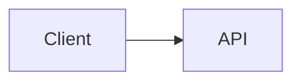

# Writing Markdown for md2html

How to write `.md` that converts well with `md2html`. `md2html --guide`
prints this text for the binary you have, and `md2html --version` names
that binary. Read the quick reference and the silent traps; the rest is
detail to look up.

[[toc]]

## Quick reference

The most common needs first. Each row is the form to write; where a
construct has other spellings, they are under
[Choosing between forms](#choosing-between-forms).

| Need | Write |
|---|---|
| Link to another page | `[Setup](./setup.md)`, never `./setup.html` |
| Title, subtitle, date | `# Title` as the first heading; `subtitle:` and `date:` in front matter |
| Contents list | `[[toc]]` alone on a line |
| Note or tip | `> [!NOTE]` on its own line, then `> text` |
| Warning | `> [!WARNING]` on its own line, then `> text` |
| Callout with a title | `::: callout Title` … `:::` (`::: warning Title` for a warning) |
| Collapsible block | `::: details Title` … `:::` |
| Code block with a caption | ```` ```go {caption="server.go"} ```` |
| Diagram | a ```` ```mermaid ```` fence |
| Stable heading anchor | `## Title {#my-id}` |
| Cross-reference to a numbered heading | `§4.2` |
| Status badge | `[draft]`, `[proven]`, `[verified]`, `[designed]`, `[planned]`, `[deprecated]` |
| Any other badge | `[needs review]{.chip}` |
| Aside or worked example | `::: aside Title` or `::: example Title` … `:::` |
| Stat tiles, term grid, titled panel | `::: stats`, `::: defs`, `::: group Title` … `:::` |
| Navigation block | `::: nav {aria-label="Section"}` … `:::` |
| Hand-laid-out figure | a ```` ```fig ```` fence with a YAML body |
| Page language | `lang: de` in front matter |
| Output for a host that supplies the page (a Claude Artifact) | `--fragment` |

## Silent traps

Each of these gives valid output, a zero exit and no warning. Check for them
before you finish.

1. **A fence inside a fence needs a longer outer fence.** Showing a
   three-backtick block takes four backticks around it, and showing a `:::`
   container inside a container takes `::::` on the outer one. See
   [Nesting fences](#nesting-fences).
2. **An unclosed `:::` container runs to the end of the document**, headings
   and all.
3. **Link to the `.md` source, never the `.html` output.** An `.html` link
   is never matched to the page md2html emits, and when the file exists
   nothing warns. See [Links and images](#links-and-images).
4. **Only the first class names a container's kind.** `::: {.compact
   .warning}` is a plain, unstyled div; write `::: warning {.compact}`.
5. **A container class outside the shipped kinds is unstyled.**
   `::: {.house-style}` is a plain classed div. Only the bare-word form,
   `::: house-style`, warns.
6. **`title:` in front matter sets only the browser tab.** Still write the
   `# Title` heading.
7. **Front matter must be the first bytes of the file and closed by `---`.**
   After a byte order mark, or without the closing line, it renders as body
   text.
8. **`[word]` next to `{…}` becomes a span.** `map[key]{value}` in prose
   renders `map<span>key</span>` and loses `{value}`. Put it in a code span.
9. **A backslash does not escape a status word or `§`.** `\[draft]` is
   still a badge. Put it in a code span.
10. **An unquoted ` #` in a `fig` label starts a comment.** `box: Step #3`
    renders "Step". Other unquoted labels that YAML cannot read fail with a
    warning. See [Quote labels](#quote-labels).
11. **A backtick in a code caption breaks every fence after it.** Use a
    `~~~` fence for that block.
12. **A caption on a `mermaid` fence is dropped.** Caption the diagram in
    prose.
13. **A `|` inside a code span in a table still splits the cell.** Write
    `\|`.
14. **Markdown inside an HTML block needs a blank line before and after
    it.** Without them, `**bold**` stays literal.
15. **`## 4.2. Title` claims no number.** Anything but a space after the
    number, `.`, `)` or `:`, stops `§4.2` from linking to it.
16. **A fragment in a link is never checked.** `./b.md#no-such` passes.
17. **Two explicit `{#same}` ids both stay.** The page then has duplicate
    ids, and links go to the first.
18. **A heading's attribute block needs double-quoted values.** A bare key
    or a single-quoted value, as in `## Setup {#setup data-flag}`, leaves
    the whole block in the heading text, id included. See
    [Headings and anchors](#headings-and-anchors).
19. **An attribute block works only after a heading, link, image or span,
    or on a container or code fence's opening line.** After a paragraph or
    list item, `{.lead}` stays literal text.

## Page structure

### Front matter

A `---` block at the very top of the file, of flat `key: value` lines:

```markdown
---
title: Rollback runbook
subtitle: What to do when a deploy fails
date: 2026-09-11
lang: en-GB
toc: float
toc-title: Contents
---

# Rollback runbook
```

| Key | Effect |
|---|---|
| `title` | The `<title>`, shown in the browser tab. Nothing on the page. |
| `subtitle` | A `<p class="subtitle">` under the first `<h1>`. |
| `date` | A `<p class="docdate">` under the subtitle. |
| `lang` | The page's `<html lang>`. Overrides `--lang`; default `en`. |
| `toc` | The contents list's layout: `inline`, `float` or `none`. See [Contents list](#contents-list). |
| `toc-title` | The contents list's name for screen readers. Default `Table of Contents`. |

`lang` is what screen readers use to pick a voice. A value that is not a
language tag, such as `en_US`, warns and is ignored.

Keys are case-insensitive, a value may be quoted (`title: "Rollback: why"`),
and a repeated key keeps its last value. Any other key does nothing on the
page, but it still travels in the embedded source unless you build with
`--no-source`.

The block must be flat. A nested value, a YAML comment, or a line without a
colon makes the whole block fail to parse, and it renders as body text with
a warning.

Without front matter, an italic line directly under the first `<h1>` becomes
the subtitle. That also happens to an italic line you meant as prose, such
as `*Draft, do not circulate*`; give the page a `subtitle:` or put the
line lower down.

### Title

Write the title as the first `# heading`. The page `<title>` comes from
front matter `title:`, else from that first `<h1>`, else from the file name.

### Headings and anchors

Every heading gets an `id` and a hover anchor link. Slugs follow the rules
GitHub, GitLab and Pandoc share: lower case, punctuation dropped, each space
a hyphen, nothing merged afterwards. `## Sizes: small × large` is
`#sizes-small--large`. Letters and digits from any script are kept, so
`## はじめに` is `#はじめに`; a heading with none gets `section-N`. A repeated
heading is numbered: the second `## Setup` is `#setup-1`. A status badge in
a heading stays out of its slug.

For an anchor that survives rewording, give the heading an explicit id:

```markdown
## Breaking change in v2 {#breaking-v2}
```

A heading's attribute block takes an `id`, classes, and `key="value"`
pairs, with a stricter grammar than a container's. Write every value in
double quotes: `{data-step="1"}`. An unquoted number becomes an empty
value, and a bare key (`{data-flag}`) or a single-quoted value leaves the
whole block, id included, as literal heading text. It takes the common
global attributes (`title`, `lang`, `dir`, `role`, `style`…) and `data-`
names; `aria-` names and event handlers are dropped. An explicit id is
never rewritten, and generated slugs avoid it. GitHub shows the block as
literal text.

An attribute block at the end of a heading line belongs to the heading,
even straight after a link: `## See [docs](./docs.md){.ext}` puts the class
on the `<h2>`.

### Contents list

`[[toc]]` alone in its paragraph becomes a `<nav class="toc">` listing the
page's headings, each linking to its anchor. `[TOC]` works too, in any
case. Depth shows as `›` marks, up to three. Headings inside a `details`, `aside`
or `example` block are listed too, even though the block starts closed.

```markdown
[[toc]]
```

On a long page, `toc: float` in front matter pins the list beside the text
on a wide screen. On a narrow screen and in print it is the inline list
again. `--toc float` does the same for a whole run, and `toc: inline` opts
one page out. Only the first list on a page floats.

A run can add the list itself. `--autotoc all` gives every page without a
marker one, and `--autotoc long` only pages over 1000 lines or five
headings. It goes under the title, subtitle and date, and floats unless
`--toc` or the page's `toc:` says otherwise. `toc: none` opts one page out.

Things that leave no list:

- `toc: float` or `toc: inline` without a marker, unless `--autotoc` adds
  a list. Front matter warns; `--toc float` does not.
- A marker inside a code span or a link, or sharing its paragraph with
  other text. It stays literal.
- A page with no headings, or built with `--no-anchors`. The marker stays
  as literal text.
- GitLab's `[[_TOC_]]`, which is not recognized.

## Links and images

**Link to the `.md` file.** md2html rewrites it to the page it emits and
works out the relative path:

```markdown
[Auth](./api/auth.md)          -> href="api/auth.html"
[Setup](./api/auth.md#setup)   -> href="api/auth.html#setup"
```

Reference-style links are rewritten the same way. `.md` and `.markdown` are
document extensions; every other file is an asset.

- **A link to a missing `.md` warns** and is left as written.
- **An `.html` link is an asset link, not a page link.** If the file is
  missing it warns; if it exists, `-o` points the link back at the source
  tree. It is never matched to the page md2html emits.
- **A link starting with `/` is a filesystem path**, not a site path, so it
  usually warns that the target does not exist. Use relative links.
- **A link to a directory** points at the directory, not at an index page
  inside it. Link the file.
- **A query string on a document link is dropped.** `./b.md?v=2` becomes
  `b.html`. Fragments are kept.
- **Links inside code are inert.** A fenced example containing
  `[a](./nope.md)` is not followed and does not warn.

**Assets are linked, not copied.** With `-o`, an image link is rewritten to
point back at the original file, so moving the output tree on its own
breaks images. Without `-o`, each page sits beside its source and links are
left as written. `` and Markdown images are rewritten and checked;
`srcset`, `<video poster>`, `<track src>` and `<object data>` are not.

**A link or image can carry attributes.** Write a `{#id .class key=value}`
block straight after it, with no space (Pandoc's `link_attributes`):

```markdown
[Intro](./intro.md){aria-current=page}   -> <a href="intro.html" aria-current="page">
{width=50% .wide}   -> 
```

It takes the global attributes, some of the element's own (`target`,
`rel`, `download`, `referrerpolicy` on a link; `width`, `height`,
`loading`, `decoding`, `sizes` on an image), and any `data-` or `aria-`
name. `hreflang` and `type` are among those dropped. Anything else, such as an event handler, is
dropped. `href`, `src` and `srcset` warn: write the target in the link. A
block with a space before it, with nothing in it, or with something that is
not an attribute name (`{{version}}`) stays as literal text.

Off-site links get `target="_blank" rel="noopener noreferrer"`, added to
any `rel` you wrote.

## Callouts and containers

### Alerts

Use GitHub's alert syntax for a note or a warning. It renders natively on
GitHub, Obsidian and Typora, and as a blockquote everywhere else.

```markdown
> [!WARNING]
> This overwrites state.
```

`NOTE`, `TIP` and `IMPORTANT` render as a `callout`; `WARNING` and
`CAUTION` as a warning callout. The marker must be upper case and alone on
its line: `[!note]`, `[!HINT]` and `> [!NOTE] Title` stay ordinary
blockquotes. The box shows no "Note" or "Warning" label, as GitHub does, so
do not write text that relies on one. An alert takes no title, id or class;
use a container when you need one.

### Containers

A container is a block between `:::` fences. Write the kind after the
opening fence, then an optional title, then an optional attribute block:

```markdown
::: warning Before you migrate
Back up the database first.
:::

::: aside Why this matters {#why .compact}
Because.
:::
```

The space after `:::` is optional. The opening fence needs a kind or an
attribute block: `:::` alone is literal text, and so is the closing line of
a container that was never opened.

| Kind | Element | Use it for |
|---|---|---|
| `callout` | `<div class="callout">` | A highlighted note that needs a title, id or class |
| `warning` | `<div class="callout callout-warning">` | The same, for a warning |
| `card` | `<div class="card">` | A bordered panel for a self-contained item |
| `details` | `<details class="container">` | Content the reader expands on demand |
| `aside` | `<details class="container aside">` | A tangent, collapsed by default |
| `example` | `<details class="container example">` | A worked example; its summary reads "Example — Title" |
| `stats` | `<div class="stats">` | A row of stat tiles |
| `defs` | `<div class="defs">` | A term/definition grid |
| `group` | `<div class="group">` | A titled panel |
| `nav` | `<nav>` | A navigation landmark; adds no class |

`details` with no title shows "Details"; `aside` with none shows "Aside".

**Other spellings.** Pandoc's braced form, `::: {.warning #id}`, and the
directive form, `:::aside[Title]{#id}`, both work. Use the braced form,
with no title, only in a file that Pandoc also reads; every titled form
breaks there. Use the directive form when a title ends in something shaped
like `{…}`: in any other form a trailing brace group is read as
attributes, so `::: card The {x}` is titled "The".

**Only the first class names the kind.** In the braced form,
`{.warning .compact}` is a warning, but `{.compact .warning}` is a plain
`<div class="compact warning">`, unstyled, with no warning. Put the kind
first, or outside the braces.

**Unknown kinds.** `::: house-style` warns and emits an unclassed `<div>`,
with the title kept as a plain paragraph. `::: {.house-style}` emits a
classed, unstyled `<div>` without a warning, as a hook for a stylesheet you
supply. `::: {#only-an-id}` is an unclassed `<div>`.

**Attributes.** The block takes an id, classes, the global attributes and
any `data-` or `aria-` name, case-insensitively. Anything else, such as an
event handler, is dropped, as is any name starting `data-fence`, which md2html
reserves. A bare key (`{data-flag}`) and a single-quoted value work.
Classes merge with the kind's own.

**Nesting.** Containers nest. An inner `:::` closes the nearest open
container, so a container whose body shows `:::` source, inside a code
block or not, needs a longer outer fence:

````markdown
:::: example Writing a callout
```markdown
::: callout
Text.
:::
```
::::
````

### stats, defs and group

`stats` and `defs` hold a definition list. In `stats` each term is a
tile's value, its first definition the label, and an optional second
definition a detail line. Either one without a definition list warns.

```markdown
::: stats
99.9%
: uptime
: over the last 90 days

4
: regions
:::

::: defs
fence
: a line of colons
:::

::: group Ingest
Parse each file, then validate it.
:::
```

These look the same as the `fig` items of the same names. Use the container
unless the item sits inside a diagram: its entries are ordinary Markdown,
and the source stays readable on GitHub, which shows them as plain lines.

A plain definition list, with no container, is already styled as a list of
terms. Use `::: defs` when you want the terms and definitions laid out as a
grid.

### nav

`::: nav` makes a `<nav>` landmark. Name it with `aria-label`, since the
contents list is already a `<nav>` and screen readers need to tell them
apart. Mark the current page on its link:

```markdown
::: nav {aria-label="Section contents"}
- [One](./one.md){aria-current=page}
- [Two](./two.md)
:::
```

### Collapsible blocks read on GitHub

`::: details` shows on GitHub as literal text with its body always open.
For a file read there too, write the HTML, with a blank line after
`<summary>` and before `</details>` so the body stays Markdown:

```markdown
<details class="container">
<summary>Title</summary>

Body in **Markdown**.

</details>
```

It renders here exactly as `::: details` does. Without the `container`
class it is unstyled.

## Code blocks

### Nesting fences

A fence closes at the first line with at least as many backticks as it
opened with.
To show a three-backtick block, open the outer fence with four:

`````markdown
````markdown
```go
func main() {}
```
````
`````

Get this wrong and the example ends early, the rest becomes body text, and
nothing warns. A `~~~` fence avoids the question for code that contains
backticks.

### Captions

A `caption` in a fence's attribute block adds a caption bar and wraps the
block in a `<figure class="code-figure">`:

````markdown
```go {caption="server.go"}
func main() {}
```
````

Write the language first and the braced block after it. GitHub reads the
first word as the language and still highlights the block, Pandoc reads the
caption, and `\"` inside the value is a literal quote.

The caption is plain text apart from status badges and `§` references,
which render as they do in prose; `*emphasis*` and links stay literal. A
backtick in a caption is invalid on a backtick fence and breaks every fence
after it; use `~~~` for that block. An `id` reaches the `<pre>` and further
classes reach the `<code>`. Other keys, including `title=`, are ignored.

Two other spellings work: brace-free, ```` ```go caption="server.go" ````,
which cannot escape a quote, and fully braced, ```` ```{.go caption="x"} ````,
which GitHub does not highlight.

## Diagrams

### Mermaid

````markdown

```mermaid
graph LR
  A[Client] --> B[API]
```
````

A page with a diagram loads a pinned MermaidJS build from a CDN, themed to
match the page in light and dark mode. `--fragment` output loads nothing,
and leaves the diagram to a host that renders mermaid itself, as a Claude
Artifact does. The fence must be spelled ```` ```mermaid ````:
```` ```{.mermaid} ```` is an ordinary code block, and a `caption=` on a
mermaid fence is dropped. Click a diagram to expand it.

Use mermaid for graphs, sequences and flowcharts. Use a `fig` fence when
you need to place things yourself: panels side by side, stat tiles beside
boxes, a file tree.

### Structured figures

A ```` ```fig ```` fence is a figure you lay out yourself, written as YAML.
The examples below are in `yaml` fences so they show as source; in a real
document they go in a `fig` fence.

```yaml
caption: Request path
items:
  - box: Client
  - arrow: HTTP POST
  - group: Server
    items:
      - box: "`auth` middleware"
      - result: 200 OK
```

#### Quote labels

Labels take inline Markdown (code spans, emphasis, links, badges, `§`
references) only when YAML reads them as a string. Quote a label that:

- starts with `` ` ``, `*`, `[`, `{`, `&`, `!`, `%`, `@`, `|` or `>`
- contains `: ` or ` #`

Unquoted, the first group fails to parse and the figure renders as a code
block with a YAML error, and ` #` starts a comment, so `box: Step #3 of 4`
silently renders "Step". An unquoted `null` or `~` is no value.

#### Kinds

Every item is exactly one kind:

| Kind | Value | What it is |
|---|---|---|
| `box` | label | a labeled box |
| `arrow` | label, may be `""` | a connector; blank is decorative |
| `result` | label | an emphasized outcome bar |
| `rail` | label | a full-width accent rail |
| `stats` | list of `value`/`label`, plus optional `detail` | a row of stat tiles |
| `defs` | list of `term`/`def` | a term/definition grid |
| `group` | title, plus `items` | a labeled panel |
| `chain` | list of items | steps connected in sequence |
| `lanes` | list of lists | parallel stacks |
| `tree` | an indented block | a file or config hierarchy |
| `cols` | list of items | items side by side |
| `split` | list of exactly 2 items | two panels either side of a `boundary` |

A blank box is `box: ""`; a bare `box:` names no kind and is an error.

#### Modifiers

| Modifier | On | What it does |
|---|---|---|
| `note` | `box`, `result`, `rail`, `group` | a quieter gloss beside the label |
| `accent` | `box`, `result`, `rail`, `group` | marks the item out from its siblings |
| `foot` | `group` | a line below the group's items |
| `boundary` | `split` | the label between the two panels |
| `weight` | a child of a `cols` layout or `cols` item | its share of the width, 1–12 |
| `items` | `group` | the group's contents |

A modifier anywhere else is an error. A panel that needs a title, an accent
or a footnote holds a `group`.

#### Layout

The top-level `layout` is `rows` (the default), `cols` or `split`. `cols`
and `split` are also item kinds, so a layout can sit anywhere an item can:

```yaml
items:
  - rail: A request crosses one trust boundary
  - split:
      - group: Client
        items: [{box: Browser}]
      - group: Server
        items: [{box: Handler}]
    boundary: TLS
  - result: The response is signed
```

A figure whose only item is a `cols` or `split` item is an error; write
`layout: cols` or `layout: split` instead. Every panel draws a card,
except one holding an arrow.

`wide: true` at the top level lets the figure extend past the text column.
It has no effect inside a container or in `--fragment` output.

#### Trees

A `tree` is an indented listing, one node per line:

```yaml
items:
  - tree: |
      src/
        * main.go -- the entry point
        util.go
      - vendor/ -- not ours
```

Indent with spaces; a tab is an error. ` -- ` splits a label from its note,
a leading `* ` accents a line and `- ` mutes it. Each needs its spaces, so
`*_test.go` stays literal; escape one with a backslash (`\--`) to keep it.

#### Faults

A figure that does not parse or validate renders as a code block and warns,
naming the item and the fault. Line numbers count from the first line of
the fence body. The figure's caption is the `caption:` key; `caption=` on
the fence line warns.

## Inline marks

### Status badges and spans

Six lowercase words in brackets become badges, in prose or a heading:

```markdown
[proven] [verified] [designed] [planned] [draft] [deprecated]
```

`[proven]` renders `<span class="chip chip-proven">proven</span>`.
`[Proven]` stays literal.

Any other badge uses Pandoc's bracketed span syntax with the `chip` class:

```markdown
[needs review]{.chip}      ->  <span class="chip">needs review</span>
[shipped]{.chip .chip-ok}  ->  <span class="chip chip-ok">shipped</span>
```

The span syntax takes any class: `[lead in]{.lead}` is a
`<span class="lead">`, unstyled unless your stylesheet names it. The label
must be plain text, since `[**x**]{.chip}` stays literal, and only classes
and an id are kept.

A badge stays literal inside a code span, a code block or a link's text.
A backslash does not stop it, so write `` `[draft]` `` to show the word.
`[c:label]` also makes a badge, up to 60 characters.

### Section cross-references

`§4.2` links to the heading whose text begins with `4.2` followed by a
space or the end of the heading. `§ 4.2` works too.

```markdown
## 4.2 Rollback

See §4.2 for details.   ->   <a class="xref" href="#42-rollback">§4.2</a>
```

Number headings `4.2`, not `4.2.`: any other character after the number
means the heading claims none. When two headings claim one number, the
first wins. A number no heading claims stays as plain text.

A possessive naming another document, "the design doc's §7", stays literal.
So does a `§` in a code span. A backslash does not stop it. `--no-anchors`
turns cross-references off along with anchors.

Use `§` when your headings are numbered. Otherwise link the heading's
anchor: `[Rollback](#rollback)`.

## Other Markdown

### Tables

GitHub tables. Each is wrapped in a horizontal scroll container, so do not
wrap one yourself. A `|` inside a code span in a cell still splits the
cell; write `\|`.

```markdown
| Option | Default |
|---|---|
| `--depth` | unlimited |
```

### Footnotes, definition lists, task lists

```markdown
Claim needing support.[^src]

[^src]: The source.

Term
: The definition.

- [ ] not done
- [x] done
```

All three render. Definition lists are styled; footnotes and task-list
checkboxes are plain HTML.

Also available: `~~strikethrough~~` (a single `~` pair strikes too, so
`H~2~O` is struck), autolinked bare URLs, and the rest of GitHub Flavored
Markdown. Not supported: math, `==highlight==`, `^superscript^` and
`:emoji:` codes, which stay literal.

### Raw HTML

Raw HTML passes through, including `<style>`, `<script>` and inline `<svg>`.
Use it only when Markdown cannot express the thing. Leave a blank line
between an HTML tag and Markdown inside it, or the Markdown stays literal:

```markdown
<div class="card">

**Bold**, as Markdown.

</div>
```

HTML comments stay in the page, and in its embedded source.

Images and inline SVGs that are scaled down to fit the text open full size
when clicked.

## Choosing between forms

Where a construct has several spellings, write the default:

- **Note or warning:** an alert, `> [!NOTE]` or `> [!WARNING]`. Use
  `::: callout Title` or `::: warning Title` only for a title, id or class.
- **Container:** `::: kind Title {#id .class}`. Braced `::: {.kind}`, with
  no title, only for a file Pandoc also reads; `:::kind[Title]{…}` only when
  a title ends in braces.
- **Collapsible:** `::: details`. `aside` for a tangent, `example` for a
  worked example, and the raw `<details class="container">` for a file read
  on GitHub.
- **Code caption:** ```` ```go {caption="x"} ````.
- **Badge:** `[draft]` for the six status words, `[label]{.chip}` for any
  other.
- **Contents list:** `[[toc]]`. `[TOC]` in a file read on GitLab, which
  builds its own list from it; GitHub shows either as literal text. Prefer
  a marker to relying on `--autotoc`, so the page places its own list.
- **Title, subtitle, date:** front matter for subtitle and date, a
  `# Title` heading for the title.
- **Reference:** `§4.2` for numbered headings, `[text](#anchor)` otherwise.
- **Diagram:** mermaid, or `fig` when you need to place things yourself.
- **Stat tiles, term grid, panel:** the container, unless the item sits in
  a `fig` diagram.

Forms mix freely within a document.

## Build behaviour

### What conversion adds

- an `id` and a hover anchor on every heading
- a horizontal scroll wrapper around every table
- `target="_blank" rel="noopener noreferrer"` on off-site links
- `.md` links rewritten to `.html`, and asset links pointed back at the
  source
- a `<title>`, from front matter, the first `<h1>`, or the file name
- the Markdown source, hidden at the end of the page with Copy and Download
  controls

Flags turn each off: `--no-anchors` (which also turns off the contents list
and `§` references), `--no-table-scroll`, `--no-external-links`,
`--no-md-links`, `--no-assets` and `--no-source`.

### Following links

Every `.md` a page links to is converted too, however far away it is, and
the run reports how many it pulled in from outside the entry points.
`--depth` limits how deep directories are scanned, not how far links are
followed; `--link-depth` limits link hops. Several entry points
(`md2html -o site ./docs ./notes`) build as one set, with links between
them rewritten.

Without `-o`, each page is written beside its source, and a link that
leaves the entry tree is refused with a warning and left as written.

`--exclude DIR` never enters or writes to a directory, and `--exclude
'AUDIT_*'` skips any file or directory with a matching name at any depth.
A link into an excluded path keeps its href and warns.

### Overwriting

md2html only overwrites HTML it generated. Any other file at an output path
is refused and the run exits non-zero. `a.md` and `a.markdown` in one
directory both map to `a.html`, and the run stops before writing anything.

md2html builds no site navigation. The contents list covers one page; link
between pages yourself.

### Fragment output

`--fragment` emits the provenance marker, `<title>`, `<style>` and body
only, for a host that
supplies the page, such as a Claude Artifact. A fragment has no script: no
mermaid runtime, no floating contents list, no click-to-expand, and no
embedded source. A mermaid fence arrives as `<pre class="mermaid">`, which
an Artifact draws and other hosts show as text.

md2html suits document-shaped pages: a report, a spec, a guide. A page that
wants an app-like layout or a bespoke look is better written as HTML.

## Styling

The default stylesheet styles text, lists, tables, code, blockquotes,
images and inline SVG, definition lists, the shipped containers, badges,
cross-references, the contents list, subtitle and date, and code captions.
It leaves footnotes and task-list checkboxes plain.

A class you add is inert unless a stylesheet names it: on a heading, a span,
or a container outside the shipped kinds, it is emitted and ignored. The
shipped class names (`callout`, `card`, `group`, `stats`, `defs`) are
styled wherever they appear, raw HTML included. `--css mine.css` replaces
the stylesheet.

## Warnings

What each warning means and how to fix it. The text in bold is the start of
the message.

**link target does not exist** — the `.md` file is missing. Fix the path.

**referenced asset does not exist** — an image or other file, or an
`.html` link, points at nothing. Fix the path; link pages by their `.md`.

**refusing to follow … outside … (no -o given)** — without `-o`, links
may not leave the entry tree. Add `-o`, or add the target's tree as an
entry point.

**not following …: excluded** — the link points into an `--exclude`d path.
Expected if that tree is built by another tool.

**exclude "…" matches nothing** / **is not a valid pattern** — check the
`--exclude` value; a name pattern cannot contain `/`.

**pulled in … document(s) from outside** — links reached pages outside the
entry points. Check none were unintended.

**front matter block is not flat key: value** — see
[Front matter](#front-matter): no nesting, comments or colon-less lines.

**front matter toc "…" has no [[toc]] or [TOC] marker** — add the marker,
or drop the `toc:` key.

**… is not a contents list layout** — use `inline` or `float`, or, in
front matter only, `none`.

**--autotoc "…" is not all or long** — use `all` or `long`. The run stops
with exit status 2; the library instead warns and ignores the value.

**… is not a language tag** — use a tag such as `en`, `de` or `pt-BR`.

**unknown container kind** — use a kind from [Containers](#containers), or
the braced form for your own class.

**container has no class and no recognizable kind name** — `::: {}` has
nothing in it. Name a kind.

**… container has no definition list** — in a `stats` or `defs`
container, write each entry as a term line followed by `: ` definition
lines.

**… cannot be set from an attribute block** — `href`, `src` or `srcset`;
write the target in the link itself.

**fig fence: …; rendering it as a code block** — the figure is shown as
its YAML source. The rest of the message names the fault:

- *did not find expected key*, *found character that cannot start any
  token*, *mapping values are not allowed in this context*, *unknown
  anchor … referenced*, *cannot unmarshal !!map into string* (or
  *!!seq*) — a label needs quotes. See [Quote labels](#quote-labels).
- *unknown key "…"* — a misspelled kind or modifier.
- *names no kind* — a bare `box:`; write `box: ""` for a blank box.
- *names … kinds* — one item per list entry.
- *carries …, which only … takes*, naming `note`, `accent`, `foot`,
  `boundary`, `weight` or `items` — move the modifier to an item that
  takes it.
- *layout … is not rows, cols or split*, *a split needs exactly 2 items* —
  fix the layout.
- *the figure's only item; write layout: cols instead* — as it says.
- *the fence is empty*, *more than one YAML document* — add items, or
  remove the `---` separator.
- *a tab in a tree's indentation*, *indented to no enclosing level* —
  indent the tree with spaces, consistently.

**fig fence: a caption in the info string is not part of a figure** —
use a `caption:` key in the body.

**output path collision** — two sources map to one page; rename one.

**refusing to overwrite … (not generated by md2html)** — an output path
holds a file md2html did not write. Move it, or choose another `-o`.
