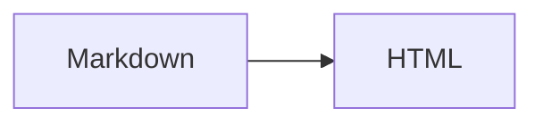

<title>Signal Decay</title>

<style>
:root { --ink: #12100e; --accent: #b4532a; }
:root:not([data-theme="light"]) { --ink: #f2eee9; }

.grid > * + * { margin-block-start: 0; }
</style>

# Signal Decay

<div class="grid">

## Nested heading

Some **markdown** inside a div, after a blank line.

</div>

Inline <span class="badge">badge</span> and a value of 5 < 7 && 9 > 3.

<svg viewBox="0 0 100 40" role="img"><path d="M0 40 L50 10 L100 30" fill="none" stroke="currentColor"/><circle cx="50" cy="10" r="3"/></svg>



```js
const ok = a < b && c > d;
```

| Stage | Loss (dB) |
|-------|----------:|
| Fiber | 0.22 |

Term
: Definition here.

A footnote ref[^1].

[^1]: The note body.

<script>
const x = 5;

if (x < 10 && x > 1) { console.log("*not emphasis*"); }
</script>

## Attributes {#custom-id .lead}

:::{.callout}
Container body.
:::

```fig
caption: Conformance figure
items:
  - box: In
  - arrow: ""
  - box: Out
```
